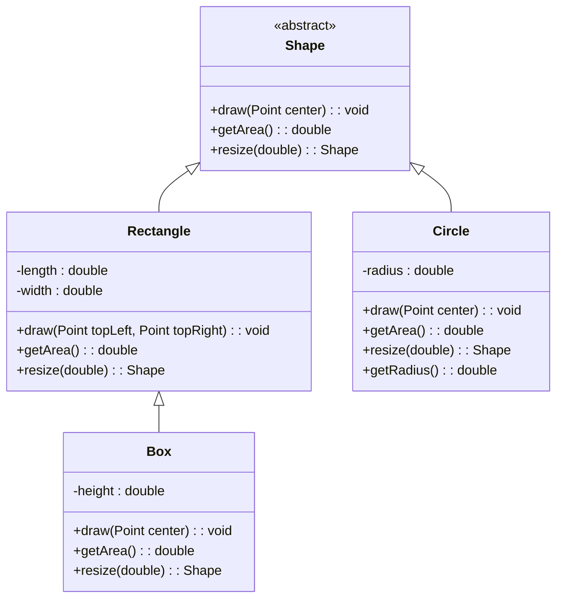
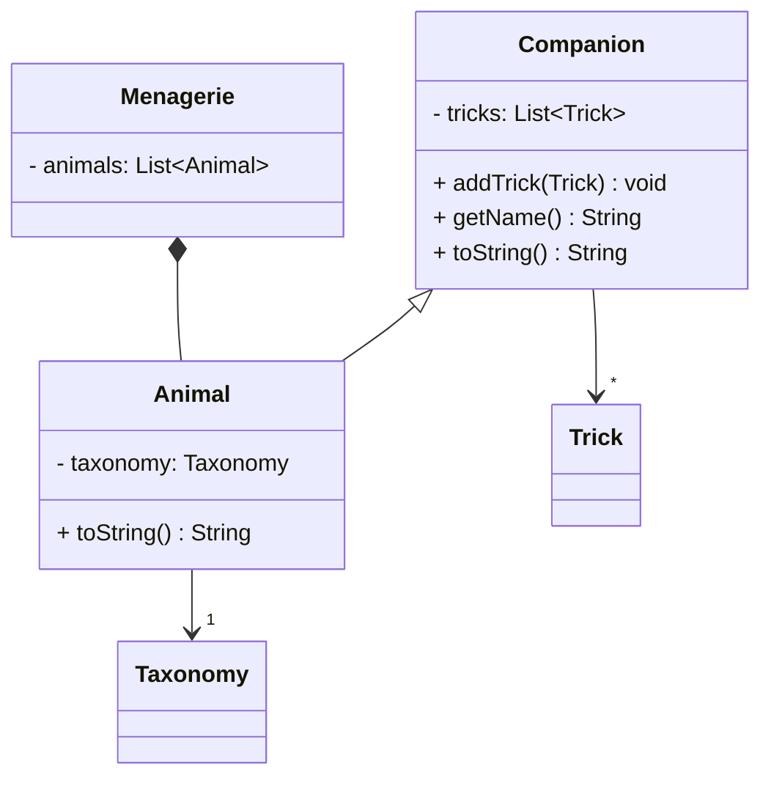

- Encapsulation
  - Encapsulation is the bundling of data with the methods that operate on that data, restricting direct access to some of the object's components. This is a means of preventing accidental interference and misuse of the data. Encapsulation is typically achieved use access modifiers like private, protected, and public.
- Inheritance
  - Inheritance is a mechanism in object-oriented programming that allows a new class to inherit properties and behaviors (methods) from an existing class. The new class, called a subclass or derived class, inherits attributes and methods from the parent class, also known as the superclass or base class. This promotes code reusability and establishes a natural hierarchy between classes.
- Polymorphism
  - Polymorphism is the ability of different objects to respond to the same method call in different ways. It allows methods to be used interchangeably, even though they may behave differently for different objects. This is typically achieved through method overriding and method overloading.
- Abstraction
  - Abstraction is the concept of hiding the complex implementation details and showing only the essential features of an object. It allows a programmer to focus on interactions at a high level without needing to understand the intricate details. Abstraction is typically achieved through abstract classes and interfaces.

- Biology analogy for OOP
  - We had never heard the biology analogy for OOP but the metaphor aptly describes the various pillars of OOP.

- Why would this be the case? Can you think of any examples where inheritance is used but it would not be polymorphic?
  - One example of inheritance without polymorphism is the use of abstract methods to pass down methods which are not inherited from the parent class.

- Box might be inheriting unnecessarily from Rectangle because it doesn't really inherit anything from Rectangle, just from Shape. Additionally it could streamline everything if the draw method had a consistent signature.

- That is a lot! Go ahead and discuss. How does this change your perspective on inheritance?
  - I think the original design tries to overdo inheritance for a class (box) when it doesn't necessarily make the implementation more efficient.

- Take time to explain the concepts to each other. What other questions come up as you discuss this? 
  - It seems like interfaces are a way to inject/enforce the implementation of specific methods for a class which can't reasonably be inherited from the parent class

- Go through the design, and highlight at least three things you can see to change just based on the code.
  - Animal class is unnecessarily implementing undefined methods such as getSpecies(). These have no purpose at the Animal class level so they can just be defined by the subclasses (or injected with an interface)
  - All the animal subclasses inherit from Companion, but we need the ability for animals to not be Companions in the Menagerie. Therefore it might be more appropriate for Companion to inherit from the different animal subclasses.
  - Animal subclasses are unnecessarily overriding methods from the Canidae or Animal class. For example, getSound could be defined at the Animal class level to return this.sound, and doesn't need to be overridden for each subclass. Different sounds can just be defined as attributes for each subclass.

     
